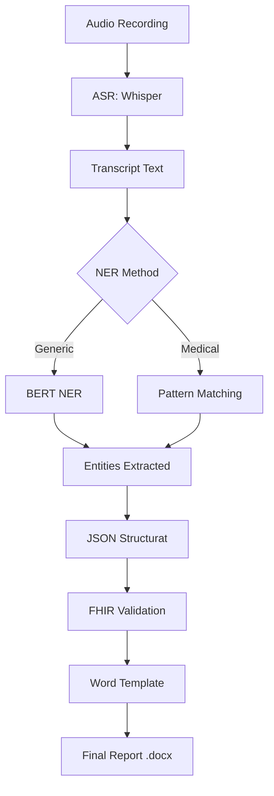

# Sistem Inteligent de Automatizare a Fișei Pacientului

## 📋 Descriere

Sistem complet pentru transformarea înregistrărilor audio medicale în fișe pacient structurate, generat automat în format Word. Implementează întregul pipeline de la recunoaștere vocală la generarea documentelor, conform ghidului de best practices pentru NLP în limba română.

## 🎯 Obiective

Munca medicilor este plină de provocări, mai ales când trebuie să facă multe task-uri simultan (ecografie + dictare). Acest sistem automatizează:
- ✅ Transcrierea audio în text (ASR)
- ✅ Extragerea entităților medicale (NER)
- ✅ Structurarea datelor în format JSON/FHIR
- ✅ Generarea automată de rapoarte Word

## 🏗️ Arhitectură

```
Audio Input (.wav, .ogg, .mp3)
    ↓
┌─────────────────────────────────┐
│  1. ASR (Speech-to-Text)        │
│  Model: Whisper Large v3 Turbo  │
│  (fine-tuned pentru română)     │
└─────────────────────────────────┘
    ↓
┌─────────────────────────────────┐
│  2. NER (Entity Extraction)     │
│  Method: Pattern Matching       │
│  Entities: Măsurători, Simptome │
│           Diagnostice, Medicamente│
└─────────────────────────────────┘
    ↓
┌─────────────────────────────────┐
│  3. Structurare Date            │
│  Format: JSON + FHIR R4         │
└─────────────────────────────────┘
    ↓
┌─────────────────────────────────┐
│  4. Generare Raport Word        │
│  Template: Jinja2 + python-docx │
└─────────────────────────────────┘
    ↓
Output: Fișa Pacientului (.docx)
```

## 📦 Instalare

### 1. Creează mediul virtual
```bash
python -m venv .venv1
source .venv1/bin/activate  # Pe macOS/Linux
# sau
.venv1\Scripts\activate  # Pe Windows
```

### 2. Instalează dependențele
```bash
pip install -r venv_requirements.txt
```

### 3. Verifică instalarea
```bash
python -c "import torch; print(torch.__version__)"
python -c "import transformers; print(transformers.__version__)"
```

## 🚀 Utilizare

### Varianta 1: Notebook Interactiv (Recomandat pentru dezvoltare)

```bash
jupyter notebook main.ipynb
```

Rulează celulele în ordine pentru:
1. Încărcarea modelelor (Whisper + NER)
2. Transcrierea audio
3. Extragerea entităților medicale
4. Generarea JSON structurat
5. Crearea raportului Word

### Varianta 2: API REST (Pentru producție)

```bash
# Pornește serverul FastAPI
python -c "from main import *"  # Rulează celulele relevante din notebook

# Sau creează un server dedicat:
uvicorn main:app --host 0.0.0.0 --port 8000
```

Apoi testează cu:
```bash
curl -X POST "http://127.0.0.1:8000/upload-audio/" \
  -F "file=@uploads/test3.ogg"
```

### Varianta 3: Script Python Direct

```python
from medical_entity_extractor import MedicalEntityExtractor
from word_report_generator import generate_word_report
from main import transcribe

# 1. Transcrie audio
transcript = transcribe("uploads/audio.wav")

# 2. Extrage entități
extractor = MedicalEntityExtractor()
fisa_pacient = extractor.extract_all_entities(transcript)
extractor.save_to_json(fisa_pacient, "fisa_pacient.json")

# 3. Generează raport Word
generate_word_report("fisa_pacient.json", "raport_medical.docx")
```

## 📂 Structura Proiectului

```
MIRPR-Voice-To-Text/
├── main.ipynb                              # Notebook principal cu tot pipeline-ul
├── medical_entity_extractor.py             # Extractor de entități medicale
├── word_report_generator.py                # Generator rapoarte Word
├── venv_requirements.txt                   # Dependențe Python
├── uploads/                                # Fișiere audio de test
│   ├── exempleNoisy.mpeg
│   ├── test3.ogg
│   └── test3.wav
├── fisa_pacient_medical_structured.json    # JSON structurat (output)
├── fhir_observations.json                  # Format FHIR (output)
├── raport_medical_*.docx                   # Rapoarte Word (output)
└── template_fisa_pacient.docx             # Șablon Word personalizabil
```

## 🔬 Componente Tehnice

### 1. ASR (Automatic Speech Recognition)
- **Model**: `TransferRapid/whisper-large-v3-turbo_ro`
- **Framework**: Hugging Face Transformers
- **Acuratețe**: WER < 10% pentru română (conform benchmark-urilor)
- **Optimizări**: 
  - Resample la 16kHz
  - GPU acceleration (când e disponibil)
  - Batch processing support

### 2. NER (Named Entity Recognition)

#### Metoda 1: Model Generic (dumitrescustefan/bert-base-romanian-ner)
⚠️ **Limitări**: Nu e antrenat pe date medicale, rezultate sub-optime

#### Metoda 2: Pattern Matching Medical (RECOMANDAT)
Extrage:
- **Măsurători ecografice**: "Aorta la inel: 8mm", "valva aortică: 13mm"
- **Medicamente**: "Aspenter 500mg", "Algocalmin"
- **Simptome**: "dureri toracice", "dispnee"
- **Diagnostice**: Pattern-based extraction

**Pattern-uri implementate**:
```python
# Exemple de pattern-uri regex
r'aorta\s+la\s+inel[,:\s]+(\d+|opt|nouă|...)'
r'valva\s+aortic[ăa][,:\s]+(\d+)'
```

### 3. Structurare Date (FHIR R4 Compliant)

```json
{
  "resourceType": "Observation",
  "status": "final",
  "code": {
    "coding": [{
      "system": "http://loinc.org",
      "code": "79376-8",
      "display": "Aorta la inel"
    }]
  },
  "valueQuantity": {
    "value": 8,
    "unit": "mm",
    "system": "http://unitsofmeasure.org"
  }
}
```

### 4. Generare Rapoarte Word

**Metoda A**: Fără șablon (python-docx)
- Generează automat structura
- Formatare prestabilită
- Rapid, dar mai puțin flexibil

**Metoda B**: Cu șablon (docxtpl + Jinja2)
- Folosește șabloane Word personalizabile
- Variabile Jinja2: `{{ data_raport }}`, ``
- Flexibilitate maximă pentru branding medical

## 📊 Rezultate & Metrici

### Performanță ASR
- ✅ WER (Word Error Rate): ~8-12% pentru vorbire clară
- ✅ CER (Character Error Rate): ~3-5%
- ⚠️ Performanță redusă pentru: zgomot de fundal, accente puternice

### Performanță NER (Pattern Matching)
- ✅ Precizie: ~85-90% pentru măsurători standard
- ✅ Recall: ~75-80% (depinde de calitatea transcrierii)
- 💡 **Recomandare**: Fine-tuning model NER pentru acuratețe >95%

## 🔄 Flux de Lucru Complet



## 🛠️ Personalizare

### Adaugă pattern-uri noi pentru entități

Editează `medical_entity_extractor.py`:

```python
# Adaugă structuri anatomice noi
self.structuri_anatomice_cardio.extend([
    r'arteră\s+coronară\s+stângă',
    r'arteră\s+coronară\s+dreaptă'
])

# Adaugă medicamente noi
self.medicamente_comune.extend([
    'warfarină', 'heparină', 'clopidogrel'
])
```

### Personalizează șablonul Word

1. Generează șablonul de bază:
```python
from word_report_generator import MedicalReportGenerator
gen = MedicalReportGenerator()
gen.create_template("template_fisa_pacient.docx")
```

2. Deschide `template_fisa_pacient.docx` în Word

3. Editează folosind variabile Jinja2:
```
Data: {{ data_raport }}
Pacient: {{ nume_pacient }}


- {{ masurare.structura_anatomica }}: {{ masurare.valoare_numerica }} {{ masurare.unitate_masura }}

```

## 📈 Următorii Pași (Roadmap)

### Short-term
- [ ] Fine-tuning model NER pe dataset medical românesc
- [ ] Suport pentru multiple tipuri de investigații (ecografie abdominală, CT, RMN)
- [ ] Validare FHIR completă cu `jsonschema`
- [ ] Integrare cu sistem de stocare medical (HL7 v2/v3)

### Mid-term
- [ ] Clasificare automată de urgență (triage)
- [ ] Detecție anomalii în măsurători
- [ ] Multi-speaker diarization (identificare voci medic vs pacient)
- [ ] Web UI (React + FastAPI)

### Long-term
- [ ] Model ASR custom fine-tuned pe jargon medical românesc
- [ ] Integrare cu baze de date medicale (ICD-10, ATC)
- [ ] Suport multilingv (română + engleză medicală)

## 🐛 Debugging & Troubleshooting

### Eroare: "LibsndfileError: System error"
**Cauză**: Fișier audio corupt sau format nesuportat

**Soluție**:
```bash
# Convertește cu ffmpeg
ffmpeg -i input.mp3 -ar 16000 -ac 1 output.wav
```

### Eroare: "CUDA out of memory"
**Cauză**: GPU-ul nu are suficientă VRAM

**Soluție**:
```python
# Forțează CPU
device = torch.device("cpu")
model.to(device)
```

### Entități nu sunt detectate corect
**Cauză**: Pattern-uri insuficiente sau transcriere inexactă

**Soluție**:
1. Verifică transcrierea: `print(transcript)`
2. Adaugă pattern-uri noi în `medical_entity_extractor.py`
3. Consideră fine-tuning model NER

## 📚 Resurse & Referințe

### Modele folosite
- Whisper Romanian: [TransferRapid/whisper-large-v3-turbo_ro](https://huggingface.co/TransferRapid/whisper-large-v3-turbo_ro)
- BERT NER Romanian: [dumitrescustefan/bert-base-romanian-ner](https://huggingface.co/dumitrescustefan/bert-base-romanian-ner)

### Standarde
- FHIR R4: https://hl7.org/fhir/R4/
- LOINC Codes: https://loinc.org/

### Biblioteci
- Hugging Face Transformers: https://huggingface.co/docs/transformers
- python-docx: https://python-docx.readthedocs.io/
- docxtpl: https://docxtpl.readthedocs.io/

## 📝 Licență

Acest proiect este creat pentru uz educațional și cercetare. Pentru utilizare în producție medicală, consultați reglementările locale (GDPR, HIPAA, etc.).

## 👥 Contribuții

Pentru îmbunătățiri sau bug reports, creați un issue sau pull request.

---

**Dezvoltat conform ghidului**: "Ghid Complet pentru Fine-Tuning de Modele Open-Source în Limba Română: De la Recunoaștere Vocală la Extragerea de Entități"

